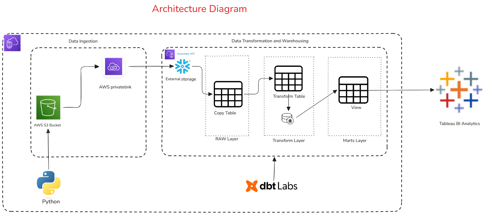

# Welcome to Walmart BI Analysis Project!

This project implements a production-ready data pipeline for analyzing walmart sales. It ingests, transforms, aggregates, and visualizes data using Python, S3, Snowflake, dbt and Tableau, following a Raw–Transform–Marts architecture.

## Business Objective \

Collect Department, Store and Fact data.
Automate data processing using dbt and generate reporting using tableau or python
Generate insights to improve marketing strategies

## Architecture

## Key Steps

### Raw Layer

Ingest raw data from CSV files using Python script.
Store in S3 walmart-s3-raw-data-bucket bucket under RAW_DATA folder.
Create copy and Raw table and load the csv data to copy table in Data schema in Snowflake DB using dbt models.

### Transform Layer

Clean, standardize, and deduplicate data
Create dimension with SCD1 logic applied and fact tables with SCD2 logic using dbt model.
Create Snapshots in dbt to perform SCD 2 logic on fact tables in Snowflake DB.

### Marts Layer

Create Fact view under Marts Schema with version start and version end date columns to track the historical changes of the table.
Aggregate KPIs and metrics
Prepare dashboard-ready datasets

### Visualization
Interactive charts using Python Seaborn library.
Secure, scalable, and cost-efficient
Generates actionable marketing insights report.

